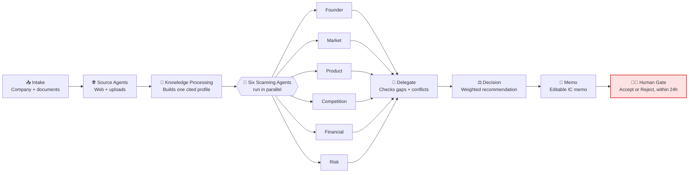
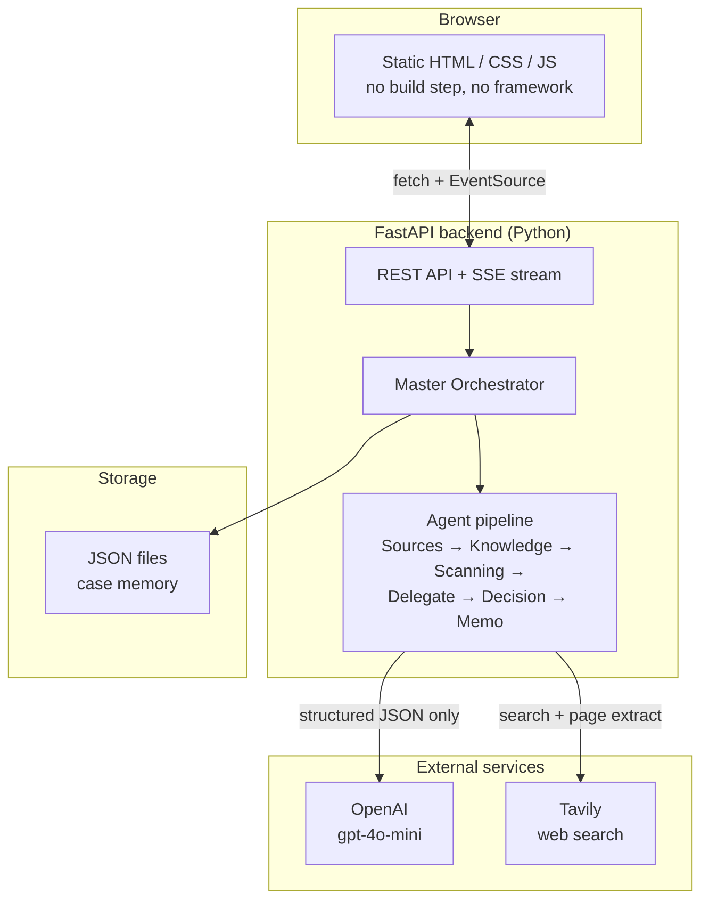

<div align="center">

# 🌱 FounderPulse

**An AI team that helps investors decide, faster — but never decides for them.**


[](https://founderpulse.onrender.com/)

</div>

---

## What is this?

When a venture investor looks at a new startup, they usually have to dig through the company's
website, LinkedIn, news articles, funding databases and a pitch deck, then write up their own
notes on the founders, the market, the product, the competition, the numbers, and the risks.
That takes hours, and every analyst does it a little differently.

**FounderPulse automates the digging and the first draft of the analysis — not the decision.**

You give it a company name (plus a URL and any documents you already have), and it sends out a
team of AI agents to research it, score it across six dimensions, and write an investment memo
with every claim linked back to where it came from. A human still has to read it and click
**Accept** or **Reject**. The system is not allowed to make that call itself.

---

## Why it's built this way

Three ideas drive every design decision in this project:

1. **Show your work.** Every score comes with a confidence level and a list of sources. If the
   evidence is thin, the confidence is low — the system is not allowed to sound more certain
   than the evidence supports.
2. **Split the job into small, honest agents.** Instead of asking one AI model to "just figure
   out if this startup is good," the work is split into six focused specialists (Founder,
   Market, Product, Competition, Financial, Risk) plus a handful of coordinating agents. Each
   one only does its own job and hands off a structured result.
3. **A human always signs the final decision.** The AI's output is labeled "Recommend", "Need
   More Research" or "Decline" — that's advice, not a verdict. Only a named person can record
   the actual Accept/Reject, and they have to write down why.

---

## How a case flows through the system



The last step is drawn in red on purpose — it's the one stage a computer is never allowed to
do by itself.

Every run also streams live to the browser (using Server-Sent Events), so you can watch each
agent start and finish in real time instead of staring at a loading spinner.

---

## System architecture



There's no separate database, no message queue and no build step for the frontend — on purpose.
For a project this size, plain files and a single Python process are easier to read, run and
debug than infrastructure the project doesn't need yet.

---

## What's under the hood

| Part | Choice | Why |
|---|---|---|
| Backend | **FastAPI** (Python) | Typed request/response models, async support for running agents in parallel, built-in docs at `/docs`. |
| Frontend | **Plain HTML / CSS / JS** | No React/Vue build step — open `index.html` mentally, edit, refresh. Fast to iterate on for a hackathon. |
| LLM | **OpenAI `gpt-4o-mini`** | Cheap and fast enough for structured JSON output; every agent call uses JSON mode with a capped token limit. |
| Web research | **Tavily Search API** | Purpose-built search API for AI agents, returns clean excerpts instead of raw HTML. |
| Document parsing | **pypdf**, **python-docx** | Extracts text from uploaded pitch decks / PDFs / Word docs. |
| Live progress | **Server-Sent Events (SSE)** | One-way streaming from server to browser — simpler than WebSockets for a progress feed. |
| Storage | **JSON files on disk** | Each case and contact message is a plain JSON file. No database server to install for a demo. |
| Live agent visuals | **Custom canvas-style diagrams (CSS + JS)**, no chart library | A reusable "chain" and "radial hub-and-spoke" renderer draws both the marketing explainer and the live-run view. |

---

## The agent team

| Agent | Job | Output |
|---|---|---|
| **Source Agents** | Search the web, read the company's own site, read anything you uploaded | A list of evidence records, each with a URL and a timestamp |
| **Knowledge Processing** | Merge all that evidence into one clean company profile | A structured `StartupProfile` with every fact traced back to its source |
| **Founder Agent** | Team background, experience, execution track record | Score 0–10 + confidence + evidence |
| **Market Agent** | Market size, growth, urgency of the problem | Score 0–10 + confidence + evidence |
| **Product Agent** | Feasibility, differentiation, traction | Score 0–10 + confidence + evidence |
| **Competition Agent** | Alternatives, entry barriers, positioning | Score 0–10 + confidence + evidence |
| **Financial Agent** | Revenue, unit economics, runway | Score 0–10 + confidence + evidence |
| **Risk Agent** | Market / execution / legal / concentration risk | Score 0–10 + confidence + evidence |
| **Delegate Agent** | Checks how much evidence is missing or conflicting across all six reports | A list of open questions for the human reviewer |
| **Decision Agent** | Combines the six scores using fixed weights, then explains the result in plain language | A recommendation: *Recommend*, *Need More Research*, or *Decline* |
| **Memo Agent** | Turns everything above into a readable investment memo | Markdown memo with a full evidence appendix |

The six specialist agents don't just return a single number. Each one also returns:

- **Strengths** and **risks**, each linked to specific evidence
- **Missing information** — what it couldn't verify
- A **confidence score**, separate from the score itself (a high score built on thin evidence
  is shown as *low confidence*, not hidden)

How the six scores combine into one recommendation:

| Dimension | Weight |
|---|---|
| Founder | 25% |
| Market | 20% |
| Product | 20% |
| Competition | 15% |
| Financial | 10% |
| Risk | 10% |

| Weighted score | Confidence | Result |
|---|---|---|
| ≥ 7.5 | ≥ 0.75 | **Recommend for IC Review** |
| 6.0 – 7.4 | any | **More Research** |
| < 6.0, or any agent flags a serious concern | any | **Decline / Watchlist** |

These weights live in one file (`app/scoring.py`) so a fund can tune them without touching any
agent code.

---

## Project structure

```text
FounderPulse/
├── backend/
│   ├── app/
│   │   ├── main.py                    # FastAPI app + all routes
│   │   ├── orchestrator.py            # Runs the full pipeline end to end
│   │   ├── schemas.py                 # All data shapes (Pydantic models)
│   │   ├── scoring.py                 # Dimension weights + decision thresholds
│   │   ├── progress.py                # Tracks live runs for the SSE stream
│   │   ├── document_parser.py         # Reads uploaded PDF / DOCX / TXT files
│   │   ├── memory_store.py            # Saves cases + contact messages as JSON
│   │   ├── clients/                   # Thin wrappers around OpenAI and Tavily
│   │   ├── prompts/                   # One shared system-prompt template every agent uses
│   │   └── agents/
│   │       ├── sources_agent.py
│   │       ├── knowledge_processing_agent.py
│   │       ├── scanning/              # The six specialist agents
│   │       ├── delegate_agent.py
│   │       ├── decision_agent.py
│   │       ├── memo_agent.py
│   │       └── reflection_agent.py    # Stub — see "What's not built yet"
│   ├── data/
│   │   └── cases/                     # One JSON file per completed case
│   ├── requirements.txt
│   └── .env                           # API keys (never committed)
└── frontend/
    ├── index.html
    ├── style.css
    └── app.js                         # Vanilla JS — no build step
```

---

## Getting started

**You'll need:** Python 3.11+, an [OpenAI API key](https://platform.openai.com/api-keys), and a
[Tavily API key](https://tavily.com/) (it has a free tier).

```bash
# 1. Set up the backend
cd backend
python -m venv .venv

# Windows
./.venv/Scripts/python.exe -m pip install -r requirements.txt

# macOS / Linux
source .venv/bin/activate
pip install -r requirements.txt

# 2. Add your API keys
cp .env.example .env
# then open .env and fill in OPENAI_API_KEY and TAVILY_API_KEY

# 3. Run it
./.venv/Scripts/python.exe -m uvicorn app.main:app --reload --port 8000
```

Open **http://127.0.0.1:8000** — the backend serves the frontend directly, so that's the only
URL you need. API docs are auto-generated at `/docs`.

---

## Using it

1. Click **New case**, type in a company name, and optionally add its URL and drop in a pitch
   deck (PDF, DOCX or TXT).
2. Watch the live workflow diagram light up as each agent finishes — nothing is simulated, it's
   reading real events off the server.
3. Read the memo. Every claim links to a source in the evidence appendix at the bottom.
4. Click **Accept** or **Reject** and write down why. That's the only step a human has to do.

A typical case runs in **20–60 seconds** and costs **about $0.0024** (roughly a quarter of a
cent) in OpenAI usage — 8 model calls, about 10,000 tokens total, all on `gpt-4o-mini`. The exact
breakdown is included in every case's response so nothing about the cost is hidden.

---

## API reference

| Method | Path | What it does |
|---|---|---|
| `POST` | `/api/cases/start` | Starts a new case (company info + optional files). Returns a `run_id` immediately. |
| `GET` | `/api/runs/{run_id}/stream` | Live progress for that run, as Server-Sent Events. |
| `GET` | `/api/cases` | List every saved case. |
| `GET` | `/api/cases/{case_id}` | Full detail for one case — profile, all six reports, decision, memo. |
| `POST` | `/api/cases/{case_id}/human-decision` | Records the final Accept/Reject and rationale. |
| `POST` | `/api/contact` | Submits a contact form message. |
| `GET` | `/api/contact` | Lists submitted contact messages. |
| `GET` | `/api/health` | Health check. |

---

## What's not built yet

This is a working prototype, not a finished product. Being upfront about the gaps:

- **No automatic follow-up research.** If an agent is missing evidence, that gap goes straight
  into the memo for a human to chase — the system doesn't yet go and search again on its own.
- **No deadline reminders.** The memo shows a 24-hour countdown, but nothing automatically
  emails or pings anyone as it gets close.
- **Evidence sources aren't finely classified.** Everything from a web search is currently
  labeled the same way, rather than ranking a company's own website above a random blog post.
- **No "lessons learned" memory yet.** Every case is saved, but the system doesn't yet compare
  outcomes across cases to improve future recommendations — that needs real outcomes to learn
  from first.
- **Files on disk, not a database.** Fine for a demo; would need to move to a real database
  before handling many users at once.
- **No login system.** Anyone who can reach the server can see every case.

---

## Author

Built by **Sandra Chan** — [LinkedIn](https://www.linkedin.com/in/sok-chan/)

© 2026 Sandra Chan
